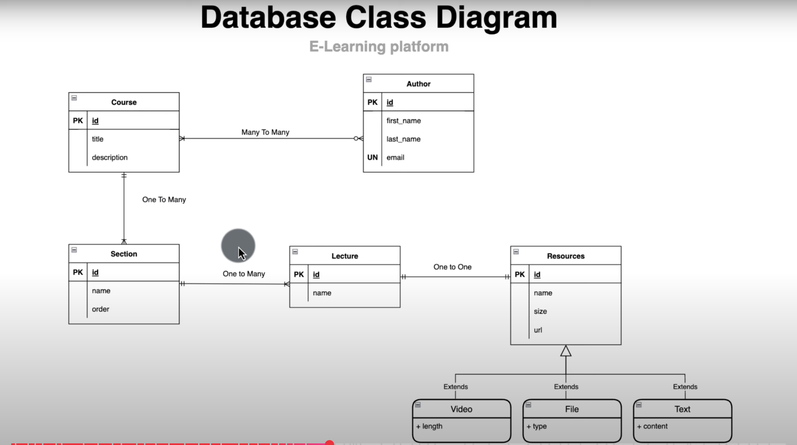
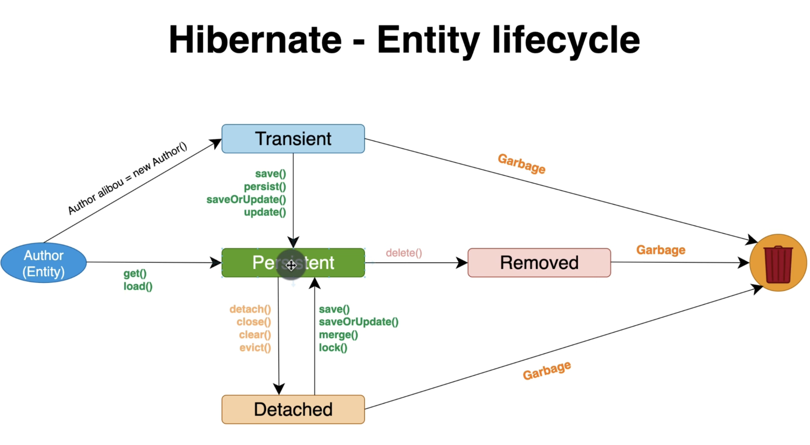

# Rest API building with Spring Boot 🚀

Welcome to my learning notes for Spring Boot based on the [Devtiro YouTube tutorial](https://www.youtube.com/watch?v=Nv2DERaMx-4). This README serves as my dev journal — covering key concepts, commands, and code snippets for quick reference and revision.

---

## 📚 Index

1. [Quickstart with Spring Initializr](#1-quickstart-with-spring-initializr)
2. [Maven Basics](#2-maven-basics)
3. [Spring Framework & Boot](#3-spring-framework--boot)
4. [Dependency Injection](#4-dependency-injection)
5. [Configuration](#5-configuration)
6. [Spring Data JPA - PostgreSQL](#spring-data-jpa)
9. [Jackson & JSON](#9-jackson--json)
10. [Building a REST API](#10-building-a-rest-api)
11. [Deployment to AWS LightSail](#11-deployment-to-aws-lightsail)

---

## 1. Quickstart with Spring Initializr

### 📌 What is Spring Initializr?

Spring Initializr is an online tool provided by Spring to generate a base project structure for Spring Boot applications. It saves you from manually setting up folders, dependencies, and build files.

🔗 Link: [https://start.spring.io](https://start.spring.io)

---

### 🛠️ Steps to Create a New Project

1. **Go to**: [start.spring.io](https://start.spring.io)
2. **Project**: Maven (or Gradle)
3. **Language**: Java
4. **Spring Boot Version**: Choose stable (e.g. 3.2.x)
5. **Project Metadata**:
    - Group: `com.example`
    - Artifact: `my-springboot-app`
    - Name: `MySpringBootApp`
    - Package name: `com.example.myspringbootapp`
6. **Packaging**: Jar
7. **Java Version**: Choose according to your JDK (17 or 21)
8. **Dependencies**:
    - Spring Web
    - Spring Boot DevTools (optional, for live reload)
    - Spring Data JPA (later for DB)
    - H2 Database or MySQL Driver (later for DB)

9. Click **Generate** to download the ZIP.
10. Extract and **open in IntelliJ / VS Code / Eclipse**.

---

### 📁 Project Structure Overview

```plaintext
├── src/
│   ├── main/
│   │   ├── java/
│   │   │   └── com/example/myspringbootapp/
│   │   │       └── MySpringBootAppApplication.java
│   │   └── resources/
│   │       ├── application.properties
│   │       └── static/
│   │       └── templates/
│
├── pom.xml
└── README.md
```

🧪 Run the App
If using IntelliJ:

Right-click on MySpringBootAppApplication.java > Run

Or run from terminal:
```bash
./mvnw spring-boot:run
```

Visit http://localhost:8080 — empty for now, but app is live!

---

## 2. Maven Basics

Maven is the **build tool** used in most Spring Boot projects. It handles:

- Project dependencies (`pom.xml`)
- Building and packaging the app
- Running the app
- Generating reports, etc.

---

### What is `mvnw`?

- `mvnw` stands for **Maven Wrapper**.
- Allows you to run Maven **without installing it globally**.
- Ensures your project uses the correct Maven version.

Use this instead of `mvn`:
```bash
./mvnw <command>       # Unix/macOS
mvnw <command>         # Windows
```

### Common Maven Commands

| Command                 | Description                              |
|------------------------|------------------------------------------|
| `./mvnw clean`         | Cleans the `/target` directory           |
| `./mvnw package`       | Builds the app & creates a `.jar` file   |
| `./mvnw install`       | Builds & installs the app to local repo  |
| `./mvnw verify`        | Runs all checks/tests before build       |
| `./mvnw site`          | Generates an HTML project site           |
| `./mvnw spring-boot:run` | Runs your Spring Boot app (via plugin) |

---

## 3. Spring Framework & Boot

---

### 3.1 Spring Framework vs Spring Boot

| Feature                | Spring Framework                           | Spring Boot                                      |
|------------------------|---------------------------------------------|--------------------------------------------------|
| **Setup**             | Manual setup, lots of XML or Java config   | Auto-configured, minimal setup                   |
| **Dependency Handling** | You manage everything via `pom.xml`       | Smart defaults & starter dependencies            |
| **Web Server**         | Requires external server (Tomcat, Jetty)  | Embedded server (Tomcat by default)              |
| **Boilerplate Code**   | High                                       | Minimal                                           |
| **Learning Curve**     | Steep                                      | Easier for beginners                             |

✅ Spring Boot is built **on top of** Spring Framework, and it simplifies development by handling the tedious parts for you.

---

### 3.2 Spring Application Layers

Spring encourages a **layered architecture** for building maintainable applications:


**How they work:**
- The **Controller** delegates to the **Service**.
- The **Service** talks to the **Repository**.
- Each layer is loosely coupled and testable.

📌 Annotations you'll see:
- `@RestController` – for the Controller layer
- `@Service` – for the Service layer
- `@Repository` – for the Repository/DAO layer

---

### 3.3 Modularity

Modularity means **separating concerns** into focused, reusable units.

✅ In Spring Boot:
- Each class handles one specific responsibility.
- The structure supports **clean code** & **independent testing**.

🧱 You can also create **separate packages or modules** for:
- Authentication
- Payments
- User Profiles
- etc.

> Think of your app as a group of LEGO blocks 🧱 — easy to build, easy to modify.

---

## 4. Dependency Injection

---

### 4.1 What is Dependency Injection?

Dependency Injection (DI) is a design pattern where **dependencies (objects)** are **injected into a class**, rather than the class creating them itself.

In Spring Boot, DI helps in building **loosely coupled**, **testable**, and **maintainable** applications.

For example:

```java
// Without DI
UserService userService = new UserService(new UserRepository());

// With DI
@Autowired
private UserService userService;
```

Spring takes care of creating and injecting the required beans into your class at runtime.

### 4.2 Inversion of Control (IoC)

IoC (Inversion of Control) is the principle behind DI.

It means:
>"You don't control object creation — Spring does."

Instead of manually creating dependencies inside your code, you let the Spring IoC container handle it for you.

>Traditional way: You call the object
> 
>IoC way: The framework gives you the object

IoC is enabled in Spring using:

- Annotations like @Component, @Service, @Repository, @Controller

- @Autowired to inject the dependency

- Spring Context / IoC Container

#### Key Annotations

| Annotation         | Purpose                                |
|--------------------|----------------------------------------|
| `@Component`       | Generic Spring-managed bean            |
| `@Service`         | Marks a service layer class            |
| `@Repository`      | Marks a DAO/repository layer class     |
| `@Controller`      | Used in MVC controllers                |
| `@RestController`  | Controller that returns JSON/XML       |
| `@Autowired`       | Injects dependencies automatically     |

### 🧠 What is a Bean?

In Spring, a **Bean** is simply an **object that is managed by the Spring IoC container**.

Any class that you want Spring to manage (create, configure, and inject where needed) must be registered as a bean.

Beans are the **core building blocks** of a Spring application — they are created, injected, and managed by the framework.

---

### 🔁 How are Beans created?

There are **3 common ways** to define a Bean in Spring:

1. Using `@Component` Annotation  
2. Using `@Bean` Annotation inside a `@Configuration` class  
3. XML Configuration (not common in Spring Boot)

---

### ✅ 1. Creating a Bean using `@Component`

```java
@Component
public class MyBean {
    public void sayHello() {
        System.out.println("Hello from MyBean!");
    }
}
```

- This class will be automatically detected and registered as a Bean **if it's in a package scanned by Spring**.
- Spring will create an instance of `MyBean` and manage it in the application context.

---

### ✅ 2. Injecting a Bean using `@Autowired`

```java
@Service
public class MyService {

    @Autowired
    private MyBean myBean;

    public void run() {
        myBean.sayHello();
    }
}
```

- Here, Spring automatically injects the `MyBean` object into the `MyService` class.
- This is **Dependency Injection** in action.

---

### ✅ 3. Defining a Bean using `@Bean` and `@Configuration`

```java
@Configuration
public class AppConfig {

    @Bean
    public MyBean myBean() {
        return new MyBean();
    }
}
```

- This is useful when you want full control over how the bean is created (custom constructor, parameters, etc.).
- Beans defined this way are also managed by the Spring container.

---

### 📦 Bean Lifecycle (Overview)

1. **Creation**: Spring instantiates the bean.
2. **Dependency Injection**: Injects required dependencies.
3. **Initialization**: Optional custom init logic.
4. **Ready to Use**: Bean is in use.
5. **Destruction**: Called before the container is shut down.

---

### 📌 Summary

| Concept          | Description                                           |
|------------------|-------------------------------------------------------|
| What is a Bean?  | An object managed by Spring’s IoC container           |
| Annotations      | `@Component`, `@Service`, `@Repository`, `@Bean`      |
| Injection        | Done using `@Autowired` or constructor injection      |
| Config Location  | Automatically scanned or registered via `@Configuration` |

---

## 🚀 @SpringBootApplication Annotation

---

### 🧩 What is `@SpringBootApplication`?

`@SpringBootApplication` is a **convenience annotation** that combines **three core Spring annotations**:

```java
@Target(TYPE)
@Retention(RUNTIME)
@SpringBootConfiguration
@EnableAutoConfiguration
@ComponentScan
public @interface SpringBootApplication {
}
```

So when you use `@SpringBootApplication`, you're really applying:

| Annotation             | Purpose                                                                 |
|------------------------|-------------------------------------------------------------------------|
| `@SpringBootConfiguration` | Same as `@Configuration` → marks this as a config class for Spring Boot |
| `@EnableAutoConfiguration` | Tells Spring Boot to automatically configure your app based on the dependencies present |
| `@ComponentScan`           | Scans the current package and sub-packages for Spring components like `@Component`, `@Service`, `@Repository`, `@Controller` |

---

### 🧠 How It Works Internally

1. **`@SpringBootConfiguration`**
   - Extends `@Configuration`, which marks the class as a source of bean definitions.
   - It registers beans in the Spring Application Context.

2. **`@EnableAutoConfiguration`**
   - Automatically configures Spring components based on the libraries present in the classpath.
   - Example: If Spring Web dependency is present, it configures a Tomcat server automatically.
   - Uses `spring.factories` to load configuration classes dynamically.

3. **`@ComponentScan`**
   - Scans the current package (and sub-packages) for any class annotated with `@Component`, `@Service`, `@Repository`, or `@Controller`, and registers them as beans.

---

### 🔁 Typical Usage Example

```java
@SpringBootApplication
public class MyApplication {
    public static void main(String[] args) {
        SpringApplication.run(MyApplication.class, args);
    }
}
```

- `SpringApplication.run()` boots up the application:
   - Starts embedded server (Tomcat/Jetty)
   - Initializes Spring context
   - Performs dependency injection
   - Configures beans

---

### ✅ Best Practices

- Place your `@SpringBootApplication` main class at the **top-level package** to ensure component scanning covers your entire project structure.
- Avoid placing beans in sibling or parent packages unless explicitly configured via `@ComponentScan(basePackages = "com.example")`.

---

### 📌 Summary

| Part of `@SpringBootApplication` | Role |
|----------------------------------|------|
| `@SpringBootConfiguration`       | Registers beans and app config |
| `@EnableAutoConfiguration`       | Enables automatic setup based on dependencies |
| `@ComponentScan`                 | Detects and registers Spring components automatically |

---

## application.properties & Environment Variables

---

### 📁 What is `application.properties`?

Spring Boot uses `application.properties` (or `application.yml`) as the **default configuration file** for your application.  
It is located in the `src/main/resources/` directory.

You can use it to define:

- Server configuration
- Database URLs and credentials
- Logging level
- Custom key-value properties
- Any other Spring/Spring Boot settings

---

### ✅ Common Examples

```properties
# Server config
server.port=8081

# Database
spring.datasource.url=jdbc:mysql://localhost:3306/mydb
spring.datasource.username=root
spring.datasource.password=admin

# JPA / Hibernate
spring.jpa.show-sql=true
spring.jpa.hibernate.ddl-auto=update

# Logging
logging.level.org.springframework=INFO
```

---

### 🌍 Environment Variables in Spring Boot

Spring Boot supports **external configuration** using environment variables. This allows you to **override properties** defined in `application.properties`.

✅ Useful in:
- Deployment (e.g., Docker, cloud)
- Securing sensitive data (like DB credentials)

---

### 🔄 Precedence (Property Loading Order)

Spring Boot resolves properties in the following order (higher overrides lower):

1. Command-line arguments
2. Environment variables
3. `application.properties` / `application.yml`
4. Default values in the code

---

### 🧠 Using Environment Variables in `application.properties`

You can reference environment variables inside the properties file:

```properties
spring.datasource.username=${DB_USER}
spring.datasource.password=${DB_PASS}
```

At runtime, Spring Boot replaces `${DB_USER}` and `${DB_PASS}` with the actual environment variable values.

---

### 🛠️ Accessing Properties in Code

```java
@Value("${custom.message}")
private String message;
```

Or using `Environment`:

```java
@Autowired
Environment env;

public void printEnvValue() {
    System.out.println(env.getProperty("custom.message"));
}
```

---

### 📌 Summary

| Concept                  | Purpose                                   |
|--------------------------|-------------------------------------------|
| `application.properties` | Central config file for Spring Boot apps  |
| Environment Variables     | Override config externally (secure/flexible) |
| `${VAR_NAME}` syntax      | Inject environment variables into config   |
| `@Value`, `Environment`   | Access config values inside Java classes  |

---

## 🌐 REST API in Spring Boot

---

### 📌 What is a REST API?

REST (Representational State Transfer) is an **architecture style** for designing networked applications. A REST API uses **HTTP methods** (GET, POST, PUT, DELETE) to interact with resources identified by **URLs**.

---

### 🧩 Key Concepts

| HTTP Method | Purpose           | Example                      |
|-------------|-------------------|------------------------------|
| GET         | Read data         | `/api/products`              |
| POST        | Create new data   | `/api/products`              |
| PUT         | Update existing   | `/api/products/1`            |
| DELETE      | Delete data       | `/api/products/1`            |

---

### 🧱 REST Annotations in Spring Boot

#### 📍 `@RestController`
- Combines `@Controller` and `@ResponseBody`
- Automatically returns JSON/XML
```java
@RestController
public class ProductController { }
```

#### 🔗 `@RequestMapping`
- Maps HTTP requests to handler methods or class level paths.
```java
@RequestMapping("/api/products")
```

#### 📥 `@GetMapping`
- Used to handle GET requests
```java
@GetMapping("/")
public List<Product> getAll() { ... }
```

#### ➕ `@PostMapping`
- Used to handle POST requests
```java
@PostMapping("/")
public Product create(@RequestBody Product p) { ... }
```

#### 📝 `@PutMapping`
- Used to handle PUT requests
```java
@PutMapping("/{id}")
public Product update(@PathVariable int id, @RequestBody Product p) { ... }
```

#### ❌ `@DeleteMapping`
- Used to handle DELETE requests
```java
@DeleteMapping("/{id}")
public void delete(@PathVariable int id) { ... }
```

---

### 🔑 `@PathVariable`

Used to extract values from the **URL path**.

```java
@GetMapping("/{id}")
public Product getById(@PathVariable int id) {
    return productService.findById(id);
}
```

---

### ❓ `@RequestParam` (Query Parameters)

Used to extract values from **URL query strings**.

```java
@GetMapping("/search")
public List<Product> searchByName(@RequestParam String name) {
    return productService.findByName(name);
}
```

**Example URL:**  
`GET /api/products/search?name=shoes`

---

### ✅ Example Controller

```java
@RestController
@RequestMapping("/api/products")
public class ProductController {

    @GetMapping
    public List<Product> getAll() { ... }

    @GetMapping("/{id}")
    public Product getById(@PathVariable int id) { ... }

    @PostMapping
    public Product create(@RequestBody Product p) { ... }

    @PutMapping("/{id}")
    public Product update(@PathVariable int id, @RequestBody Product p) { ... }

    @DeleteMapping("/{id}")
    public void delete(@PathVariable int id) { ... }

    @GetMapping("/search")
    public List<Product> search(@RequestParam String name) { ... }
}
```

---

### 🧠 Summary

- `@RestController`: REST-style JSON API
- `@RequestMapping`: Base path
- HTTP Methods: `GET`, `POST`, `PUT`, `DELETE`
- `@PathVariable`: Dynamic parts of URL
- `@RequestParam`: Query string data

---

## Spring Data JPA
---

### 🔹 1. **JDBC (Java Database Connectivity)**

**JDBC** is the base-level API for interacting with relational databases using Java. It requires:

- Establishing a `Connection`
- Writing SQL queries manually
- Executing SQL using `Statement` or `PreparedStatement`
- Iterating over `ResultSet`
- Mapping DB rows to Java objects yourself

#### 👎 Drawbacks of JDBC:

- Lots of boilerplate code
- Manual error handling
- Difficult to maintain
- Not scalable for large applications

#### 🔧 JDBC Example:

```java
Connection conn = DriverManager.getConnection(url, user, password);
PreparedStatement stmt = conn.prepareStatement("SELECT * FROM users WHERE id = ?");
stmt.setInt(1, 1);
ResultSet rs = stmt.executeQuery();

if (rs.next()) {
    User user = new User();
    user.setId(rs.getInt("id"));
    user.setName(rs.getString("name"));
    // ...
}
```

---

### 🔹 2. **JPA (Java Persistence API)**

**JPA** is a **specification** (not a library) that defines how Java objects should map to relational database tables.

✅ JPA provides:

- **Annotations** like `@Entity`, `@Id`, `@OneToMany`, etc.
- **EntityManager API** to manage objects and queries
- **JPQL (Java Persistence Query Language)** for object-based queries

❗️JPA is just an interface — it needs a  **(implementation)** like **Hibernate** to actually work.

---

### 🔹 3. **Hibernate (JPA Implementation)**

**Hibernate** is the most widely used JPA provider.

It handles:

- SQL generation
- Object-relational mapping (ORM)
- Caching
- Lazy/eager loading
- Transaction management

With Hibernate, we no longer write boilerplate SQL. Instead, we define entities and let Hibernate manage them.

#### 🧾 Entity Example:

```java
@Entity
@Table(name = "users")
public class User {
    @Id
    @GeneratedValue(strategy = GenerationType.IDENTITY)
    private Long id;

    private String name;
    private String email;
}
```

#### 🎯 Hibernate does the magic:

- Maps table to entity
- Converts SQL results to objects
- Handles insert/update/delete automatically

---

### 🔹 4. **Spring Data JPA (Abstraction over JPA + Hibernate)**

Spring Data JPA builds on top of JPA and Hibernate to **simplify the data access layer** even more. It reduces boilerplate code by:

- Automatically creating implementations for DAOs
- Providing CRUD functionality out of the box
- Integrating pagination, sorting, and custom queries easily

#### 📘 Key Interfaces:

- `JpaRepository<T, ID>` → includes `CrudRepository`, `PagingAndSortingRepository`
- `@Repository` → marks your DAO interface
- `@Transactional` → handles transactions

#### 🧩 Example:

```java
@Entity
public class User {
    @Id @GeneratedValue
    private Long id;
    private String name;
    private String email;
}
```

```java
@Repository
public interface UserRepository extends JpaRepository<User, Long> {
    List<User> findByName(String name);
}
```

Now you can use `userRepository.findAll()`, `save()`, `deleteById()`, and even custom methods like `findByName()` — **without writing any implementation**.

Spring handles it through **Spring Data JPA** + **Hibernate** under the hood.

---

## 🧠 Flow of Execution

```
Your Service Class
       ↓
UserRepository (interface)
       ↓
Spring Data JPA (auto implementation)
       ↓
JPA Specification (via Hibernate)
       ↓
SQL generated & executed
       ↓
Data returned as Java Objects
```

---

## 🔄 Comparison Summary

| Approach        | Pros                           | Cons                              |
| --------------- | ------------------------------ | --------------------------------- |
| JDBC            | Full control                   | Too much boilerplate              |
| JPA + Hibernate | Reduces SQL writing, clean ORM | Still needs `EntityManager` setup |
| Spring Data JPA | Extremely easy & powerful      | Less control over SQL sometimes   |

---

### Spring Data JPA example

#### Dependencies
- Postgres Driver
- Spring Web
- Spring Data JPA

`application.properties` File
```plaintext
spring.datasource.url=jdbc:postgresql://localhost:5432/hibernate_db
spring.datasource.username=postgres
spring.datasource.password=Amey1234

spring.jpa.hibernate.ddl-auto=create-drop
spring.jpa.show-sql=true

spring.jpa.properties.hibernate.dialect=org.hibernate.dialect.PostgreSQLDialect
spring.jpa.properties.hibernate.format_sql=true
```

ER Diagram of Project



Here’s a detailed explanation of the annotations and concepts: `@Entity`, `@Id`, `@GeneratedValue`, and `@SequenceGenerator` — used in JPA and Spring Data JPA.

---

## JPA Entity Annotations

---

### 🔹 `@Entity`
Marks a Java class as a **JPA Entity** that should be mapped to a database table.

```java
@Entity
public class User {
    ...
}
```

By default, the class name becomes the table name (`User` → `user`), and fields become columns.

---

### 🔹 `@Id`
Defines the **primary key** of the entity.

```java
@Id
private Long id;
```

This field must be unique for each row and is used to identify the entity.

---

### 🔹 `@GeneratedValue`
Specifies the **strategy** used for generating primary key values.

```java
@Id
@GeneratedValue(strategy = GenerationType.AUTO)
private Long id;
```

#### Common Strategies:

| Strategy              | Description |
|-----------------------|-------------|
| `AUTO`                | Let the JPA provider (Hibernate) decide |
| `IDENTITY`            | Uses DB auto-increment column |
| `SEQUENCE`            | Uses a DB sequence (mostly PostgreSQL) |
| `TABLE`               | Uses a table to generate identifiers |

---

### 🔹 `@SequenceGenerator`
Used with `SEQUENCE` strategy to define a custom database sequence.

```java
@Entity
public class User {

    @Id
    @GeneratedValue(
        strategy = GenerationType.SEQUENCE,
        generator = "user_seq"
    )
    @SequenceGenerator(
        name = "user_seq",
        sequenceName = "user_sequence",
        allocationSize = 1
    )
    private Long id;

    private String name;
}
```

#### Parameters:

| Parameter        | Description |
|------------------|-------------|
| `name`           | Name used in `@GeneratedValue(generator = "…")` |
| `sequenceName`   | Actual DB sequence name |

---

## Example: Complete Entity with Sequence Generator

```java
@Entity
public class Product {

    @Id
    @GeneratedValue(
        strategy = GenerationType.SEQUENCE,
        generator = "product_seq"
    )
    @SequenceGenerator(
        name = "product_seq",
        sequenceName = "product_sequence",
        allocationSize = 1
    )
    private Long id;

    private String name;
    private Double price;

    // Getters and Setters
}
```




# Spring MVC Architecture


# 🌱 Spring MVC Architecture

Spring MVC follows the **Model-View-Controller** design pattern to build web applications in a structured and maintainable way. Here's how each component works:

### 🔹 DispatcherServlet
Acts as the **front controller**. It handles all incoming HTTP requests and coordinates with other components like controllers, view resolvers, and model objects.

### 🔹 Controller
Receives requests from the `DispatcherServlet`, processes them (usually with help from a service layer), and returns a logical view name along with data (the model).

### 🔹 Model
Holds the data that needs to be displayed in the view. It’s populated by the controller and passed to the view for rendering.

### 🔹 View
The user interface part of the application (like JSP or Thymeleaf). It takes the model data and renders the final HTML response.

### 🔹 ViewResolver
Maps the logical view name (provided by the controller) to an actual view file for rendering.

### 🔹 HandlerMapping
Helps the `DispatcherServlet` determine which controller method should handle the incoming request.

---

### 🔁 Workflow Summary
1. Client sends a request.
2. DispatcherServlet intercepts it.
3. HandlerMapping finds the correct controller.
4. Controller processes the request and prepares data (Model).
5. ViewResolver finds the appropriate view.
6. View renders the response using the model data.
7. DispatcherServlet returns the final response to the client.

---

# Spring Security

**Spring Security** is a comprehensive and customizable framework for handling **security concerns** in Java-based applications—particularly those built using **Spring Boot**.

It primarily helps with:

- 🔑 **Authentication** – Validating user identity.
- 🔒 **Authorization** – Granting access to specific parts of the application.
- 🛡️  Against common vulnerabilities like CSRF, XSS, session fixation, etc.

Spring Security acts as the **security backbone** of enterprise-level apps by plugging into the Spring lifecycle and managing all security-related configurations declaratively or programmatically.

---

## Why Spring Security is Needed

Without a strong security layer:

- Applications are vulnerable to unauthorized access and data breaches.
- Security rules become hard to manage and test.
- Developers often re-implement critical security features incorrectly.

Spring Security centralizes and simplifies this by:

- Enforcing security **standards by default**.
- Providing tools for **custom rules and policies**.
- Supporting **industry practices** like form-based login, HTTP Basic, OAuth2, and JWT.

---
## 🔁 Spring Security Filters

Spring Security uses a **filter chain** to process incoming requests. Each filter in the chain performs a specific task (like authentication or CSRF protection) before allowing access to the endpoint.

Key filters include:

| Filter Name                      | Purpose                                                                 |
|----------------------------------|-------------------------------------------------------------------------|
| `SecurityContextPersistenceFilter` | Manages the `SecurityContext` (auth info) across requests.              |
| `UsernamePasswordAuthenticationFilter` | Handles form-based login authentication.                            |
| `BasicAuthenticationFilter`     | Handles HTTP Basic Authentication.                                     |
| `CsrfFilter`                    | Checks for CSRF tokens on state-changing requests (POST, PUT, DELETE). |
| `ExceptionTranslationFilter`   | Translates security exceptions into appropriate HTTP responses.        |
| `FilterSecurityInterceptor`    | The last filter that enforces access-control decisions.                |

---

## CSRF (Cross-Site Request Forgery)

**CSRF** is a type of attack where unauthorized commands are transmitted from a user that a web app trusts.

### Why is CSRF important?

Without protection:
- Malicious websites could trigger requests (like money transfers) using your session.
- The app cannot distinguish between **intentional** and **forged** requests.

Spring Security protects against CSRF by:
- Generating a unique **CSRF token** per session.
- Validating it for every unsafe request (POST, PUT, DELETE).

### When can CSRF be disabled?
- In stateless apps (like REST APIs using JWTs).
- When requests come only from trusted sources.

---